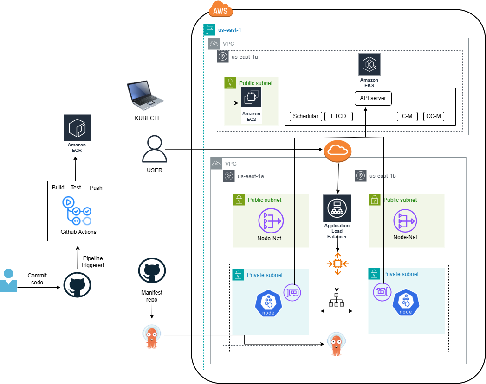

# 🚀 GitOps Deployment on EKS with ArgoCD

This project demonstrates how to deploy and manage Kubernetes applications on Amazon EKS using ArgoCD for GitOps-based continuous delivery. The infrastructure integrates GitHub Actions CI/CD pipelines for automated building, testing, and deployment to Amazon ECR, followed by ArgoCD managing the production deployments from Git manifests.

ArgoCD continuously monitors a GitHub repository and ensures that the Kubernetes cluster state matches the declared manifests (IaC).
## 🧭 Complete Architecture

## 🧱 Project Overview

| Component | Description |
|---|---|
| **EKS Cluster** | Managed Kubernetes cluster on AWS |
| **ArgoCD** | GitOps controller that deploys manifests directly from a Git repository |
| **NGINX Ingress Controller** | Provides external access to ArgoCD UI and application services |
| **Terraform** | Used to provision AWS infrastructure such as the VPC, EKS, and Bastion host |
| **GitHub Actions** | CI/CD pipelines for building, testing, and pushing Docker images to Amazon ECR |
| **Amazon ECR** | Container registry for storing Docker images |

## 🗂️ Project Structure

```
.
├── terraform/                          # Infrastructure as Code (EKS, VPC, Bastion)
│   ├── main.tf
│   ├── variables.tf
│   ├── outputs.tf
|   ├── provider.tf 
│   ├── iam/
|   ├── SecurityGroup/
|   ├── Network/
│   ├── eks/
│   └── bastion/

├── k8s-manifests/
│   ├── base/                           # Base Kubernetes resources
│   ├── overlays/                       # Kustomize overlays per environment
│   │   ├── dev/
│   │   └── prod/
└── README.md
```

## 🔄 CI/CD Architecture & Repositories

This project uses separate repositories for frontend and backend, each with its own GitHub Actions pipeline:

### Backend Repository
**Repository:** https://github.com/7azemmm/testBack.git

The backend repository includes:
- Backend application source code
- `Dockerfile` for containerization
- `.github/workflows/` - GitHub Actions pipeline that:
  - Runs automated tests
  - Builds the Docker image
  - Pushes the image to Amazon ECR

### Frontend Repository
**Repository:** https://github.com/7azemmm/frontend.git

The frontend repository includes:
- Frontend application source code
- `Dockerfile` for containerization
- `.github/workflows/` - GitHub Actions pipeline that:
  - Runs automated tests
  - Builds the Docker image
  - Pushes the image to Amazon ECR
## ⚙️ Prerequisites

Ensure you have the following installed:

- AWS CLI (configured with appropriate credentials)
- kubectl
- Terraform
- Helm
- ArgoCD CLI 
- NGINX Ingress Controller
- Docker (for local testing)
- GitHub CLI (optional, for managing repositories)

## 🚀 Setup Guide

### 1️⃣ Deploy EKS Cluster (Terraform)

```bash
cd terraform
terraform init
terraform apply -auto-approve
```

This will create:
- VPC with public and private subnets
- EKS cluster with private endpoint
- Bastion host for secure access
- Necessary IAM roles and security groups

### 2️⃣ Install ArgoCD on EKS

```bash
kubectl create namespace argocd
kubectl apply -n argocd -f https://raw.githubusercontent.com/argoproj/argo-cd/stable/manifests/install.yaml
```

Check installation:

```bash
kubectl get pods -n argocd
```

### 3️⃣ Get ArgoCD Admin Password

```bash
kubectl -n argocd get secret argocd-initial-admin-secret \
  -o jsonpath="{.data.password}" | base64 -d
```

### 4️⃣ Access the ArgoCD UI

#### Option 1: Port Forward (for private clusters)

```bash
kubectl port-forward svc/argocd-server -n argocd 8080:443
```

Then visit: https://localhost:8080

#### Option 2: SSH Tunnel via Bastion Host

```bash
ssh -i id_rsa -L 8080:localhost:8080 ec2-user@<bastion-public-ip>
```

Then visit: https://localhost:8080

#### Option 3: Using Ingress Controller

Create a file `argocd-ingress.yaml`:

```yaml
apiVersion: networking.k8s.io/v1
kind: Ingress
metadata:
  name: argocd-server-ingress
  namespace: argocd
  annotations:
    kubernetes.io/ingress.class: nginx
    nginx.ingress.kubernetes.io/backend-protocol: "HTTP"
    nginx.ingress.kubernetes.io/ssl-redirect: "false"
spec:
  rules:
    - host: argocd.<your-domain>.com
      http:
        paths:
          - path: /
            pathType: Prefix
            backend:
              service:
                name: argocd-server
                port:
                  number: 80
```

Then apply it:

```bash
kubectl apply -f argocd-ingress.yaml
```

Update your Kubernetes deployment manifests to reference this secret.

### 6️⃣ Connect ArgoCD to GitHub Repository

From ArgoCD UI:

- Go to **Settings → Repositories → Connect Repo** using HTTPS
- Enter:
  - **Repository URL:** https://github.com/7azemmm/K8s-objects
  - **Type:** Git
  - **Username/Password** or Personal Access Token
  - Click **Connect**

Or using CLI:

```bash
argocd repo add https://github.com/<your-username>/K8s-objects \
  --username <github-username> \
  --password <github-token>
```

### 7️⃣ Setup GitHub Actions Secrets (Backend & Frontend Repos)

For both backend and frontend repositories, add these GitHub secrets:

- `AWS_ACCOUNT_ID` - Your AWS account ID
- `AWS_REGION` - AWS region (e.g., `us-east-1`)
- `AWS_ACCESS_KEY_ID` - AWS IAM access key
- `AWS_SECRET_ACCESS_KEY` - AWS IAM secret key
- `ECR_REPOSITORY_NAME` - ECR repository name (e.g., `backend`, `frontend`)

These secrets are used by GitHub Actions to authenticate with AWS and push images to ECR.

### 8️⃣ Create a Kustomize App in ArgoCD (UI)

Go to **Applications → + New App**

Fill the fields:

- **Application Name:** `dev-app` (or your preferred name)
- **Project:** `default`
- **Repository URL:** (your k8s-manifests repo)
- **Revision:** `main`
- **Path:** `overlays/dev` (or `overlays/prod` for production)
- **Cluster:** `https://kubernetes.default.svc`
- **Namespace:** `default`
- Check **Kustomize**
- Choose **Automated Sync** (optional for continuous sync)
- Click **Create**

Your app will automatically deploy from your GitHub repo! 🎉


## ✅ Features

- 🔄 **Continuous Deployment** - Automated pipeline from GitHub to EKS
- 🧩 **Kustomize Support** - Multiple environments (dev, prod)
- 🐳 **Docker Integration** - Containerized applications in both backend and frontend
- 🔐 **Private Cluster Access** - Secure access via bastion host
- 🌐 **Ingress-based UI Access** - ArgoCD UI exposed through NGINX ingress
- ☁️ **Infrastructure as Code** - Terraform for AWS provisioning
- 🚀 **Automated Testing** - GitHub Actions runs tests before deployment
- 📦 **Amazon ECR Integration** - Docker images pushed to private registry
- 🔄 **GitOps Workflow** - Git as the single source of truth

## 📝 Workflow

1. Developer pushes code to backend or frontend repository
2. GitHub Actions pipeline automatically triggers
3. Pipeline runs tests and builds Docker image
4. Docker image is pushed to Amazon ECR
5. Kubernetes deployment manifests are updated (manual or automated)
6. ArgoCD detects the changes in Git
7. ArgoCD syncs the new images to the EKS cluster
8. Pods are updated with the latest image versions

## 🔗 Repository Links

- **K8s Manifests & Infrastructure:** Current repository
- **Backend:** https://github.com/7azemmm/testBack.git
- **Frontend:** https://github.com/7azemmm/frontend.git
- **k8s objects:** https://github.com/7azemmm/K8s-objects

## 👨‍💻 Author

**Hazem Mohamed**  
Backend & Cloud Engineer | AWS Certified  
GitHub: [@7azemmm](https://github.com/7azemmm)

